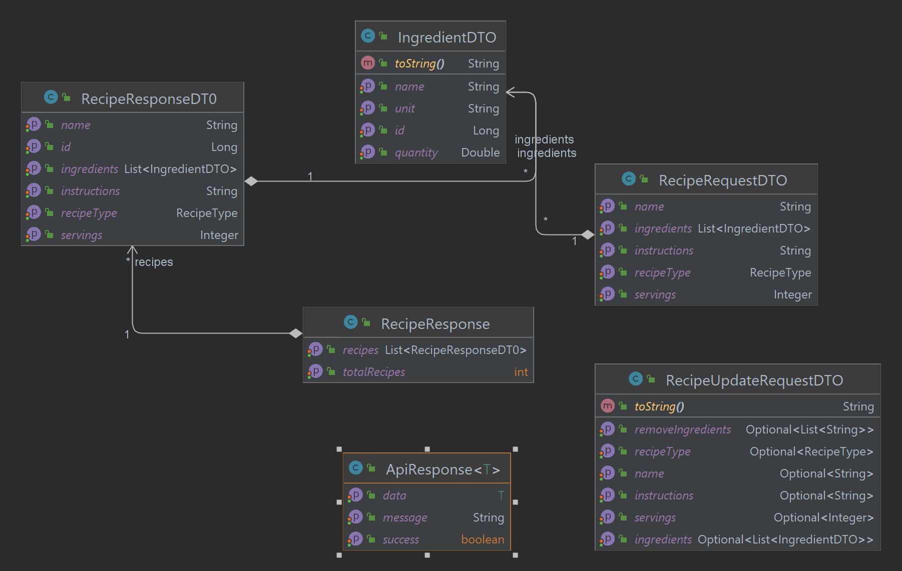
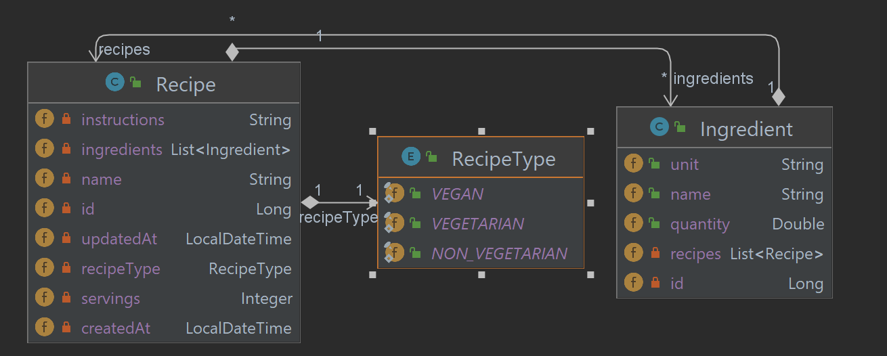
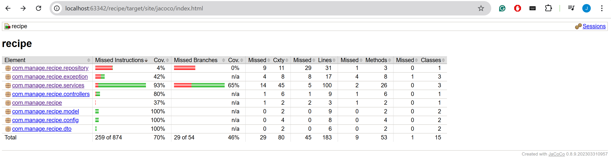

# Recipe Management API

## Overview

The Recipe Management API is a Spring Boot-based RESTful API designed for managing and filtering recipes and their ingredients.
Users can create, update, retrieve, and delete recipes, as well as filter them based on criteria such as whether the recipe is vegetarian, 
the number of servings, included/excluded ingredients, and search words within the instructions text.

## Features

- **Recipe Management**: Create, update, retrieve, and delete recipes.
- **Ingredient Management**: Each recipe can contain multiple ingredients with details.
- **Filtering Options**: Filter recipes based on various criteria such as:
    - Recipe Type having valid values as VEGAN, VEGETARIAN, NON_VEGETARIAN
    - Number of servings
    - Included and excluded ingredients
    - Text search within instructions

### Prerequisites

- **Java 17** or higher
- **Maven** for dependency management (only required if building the project)

### Running the Application

You can run the application in two ways:

#### 1. Running from the IDE

- **Open the Project**: Import into your IDE (e.g., IntelliJ IDEA, Eclipse).
- **Build the Project**: Ensure there are no build errors.
- **Run the Application**: Locate the main class with `@SpringBootApplication` and run it.
Also, ```mvn spring-boot:run``` can be used from terminal to run the application.

#### 2. Running from the JAR File

- **Download the JAR File**: Obtain the compiled JAR file.
- **Install Java**: Ensure you have the Java Runtime Environment (JRE) installed.
- **Open Command Line**: Use terminal (macOS/Linux) or Command Prompt (Windows).
- **Run the Application**:

```bash
 java -jar recipe-0.0.1-SNAPSHOT.jar
 ```

**Access the API:**
After starting the application, HTTP requests can be made using tools like Postman or curl.
Once the application is running, the API is accessible at:

```http://localhost:8080/api/recipes ```


### API Endpoints

**POST** ```/api/recipes``` To add a recipe. Takes fields in the request body.

**GET** ```/api/recipes``` To retrieve all recipes.

**PATCH** ```/api/recipes/{id}``` To update one or more fields of recipe with id.
Takes fields with values to update in request body.

**DELETE** ```/api/recipes/{id}``` To delete a recipe by giving its id.

**GET** ```/api/recipes/search``` To search recipes based on different query parameters
(e.g., ?servings=2&includeIngredients=tomato).

The following query parameters can be used to filter recipes:

- **recipeType**: Specifies the type of recipe. Acceptable values are:
    - `VEGAN`
    - `VEGETARIAN`
    - `NON_VEGETARIAN`

- **servings**: Specifies the number of servings as an integer.

- **searchInstructions**: A keyword or phrase to search within the recipe instructions.

- **includeIngredients**: A list of ingredient names that must be included in the fetched recipes.

- **excludeIngredients**: A list of ingredient names to be excluded from the recipe. 
Recipes having these ingredients will not be present in the search result.

Example Requests:

Filter Recipes:
**GET** ```/api/recipes/filter?servings=4&includeIngredients=cheese&excludeIngredients=meat&searchInstructions=grill```

Request Body for Recipe Creation (**POST** ```/api/recipes```):

```JSON
{
    "name" : "Coffee vegan",
    "recipeType" : "VEGAN",
    "servings" : 5,
    "ingredients": [{"name": "coffee powder", "quantity": 5, "unit":"gram"},
          {"name": "sugar", "quantity": 10, "unit":"gram"} ],
    "instructions": "Boil and mix"
}
```

Request Body for Recipe Update (**PATCH** ```/api/recipes/1```):

```JSON
{
    "name" : "Coffee",
    "recipeType" : "VEGETARIAN",
    "servings" : 4,
    "ingredients": [{"name": "coffee powder", "quantity": 30},
          {"name": "milk", "quantity": 30, "unit":"ml"} ],
    "instructions": "Boil and mix",
    "removeIngredients": ["sugar"]
}
```
One or more fields can be given for update.

NOTE: recipeType is a ENUM, and it can take either VEGAN, VEGETARIAN or NON_VEGETARIAN fields.

## Architecture and Technical Choices

1. Layered Architecture
   The project uses a layered architecture to maintain separation of concerns:
   - **Controller Layer:** Handles HTTP requests and responses.

   - **Service Layer:** Contains the business logic, including filtering operations.

   - **Repository Layer:** Manages data access with JPA Repositories.

DTOs (Data Transfer Objects): Used to transfer data between layers (shown below).

<p align="center">
 </p>
<p align="center">
 *Figure: Diagram showing DTO classes, their fields, and relationships* </p>

2. Database Design
   - Entities (shown in the image below):
      - Recipe with attributes such as name, recipeType, servings, instructions, and a many-to-many relationship with Ingredient.
   
      - Ingredient with attributes such as name, quantity, and unit.

- Database: An in-memory H2 database is used, with schema automatically generated based on JPA annotations.

<p align="center">
 </p>
<p align="center">
 *Figure: Diagram showing entity fields and their relationships* </p>

3. Filtering Logic

   To handle complex filtering requirements, a dynamic filtering approach is used:

- **CriteriaBuilder for Query Construction**: Filtering is managed using `CriteriaBuilder` within the `RecipeFilterRepository`. This allows dynamic query construction to apply multiple filter criteria in a single database call.

- **Filter Application**: Recipes are retrieved based on provided criteria, such as `recipeType`, `servings`, `searchInstructions`, `includeIngredients`, and `excludeIngredients`. 
   Each criterion is translated into a predicate that the query applies to filter recipes matching all specified conditions.
   If no criteria is given, all recipes are returned as there is no filter.

  This approach ensures efficient retrieval of recipes that meet all filtering criteria in a single query, reducing the need for multiple database calls and improving performance.

4. Key Libraries and Tools
 - Spring Boot: Framework for creating REST APIs.
 - Spring Data JPA: For ORM (Object-Relational Mapping) and database interactions
 - H2 Database: In-memory database for easy setup and development.
 - ModelMapper: For mapping entities to DTOs for cleaner, more concise responses.
 - Lombok: For reducing boilerplate code by generating getters, setters, etc.
 - JUnit: Testing framework for writing unit tests.
 - Mockito: Library for mocking objects in tests.
 - JaCoCo: Code coverage library to measure test effectiveness.
 - Hibernate Validator / Spring Validation: Provides validation support for application inputs and data integrity.

5. Handling Update and Delete Recipe APIs
- For PATCH (update) and DELETE operations:
The entity is first fetched by ID, modified if necessary, and then saved or deleted.
PATCH supports partial updates with checks to update only the provided fields and can update all the fields too, 
thus, PATCh is used instead of PUT.
- Updating fields in the recipe API can be complex, particularly when it comes to updating ingredients. 
There are several scenarios to consider when updating ingredients:

  **Updating Existing Ingredients**: Modify the properties (like quantity or unit) of ingredients that are already part of the recipe.
  
  **Adding New Ingredients**: Add new ingredients that were not previously present in the recipe.
  
  **Removing Ingredients**: Remove certain ingredients from the recipe.

  
  To effectively handle the removal of ingredients, a dedicated field named **`removeIngredients`** has been introduced in the update request class. 
  This field accepts a list of ingredient names that should be removed from the recipe.


### Testing
Basic tests are included in the `./src/test` folder, using JUnit.

Test coverage is tracked with **JaCoCo**.

<p align="center">
 </p>
<p align="center">
 *Figure: JaCoCo Test Coverage Report*

Sample Postman request and response screenshots are available in the `./result_imgs` folder.